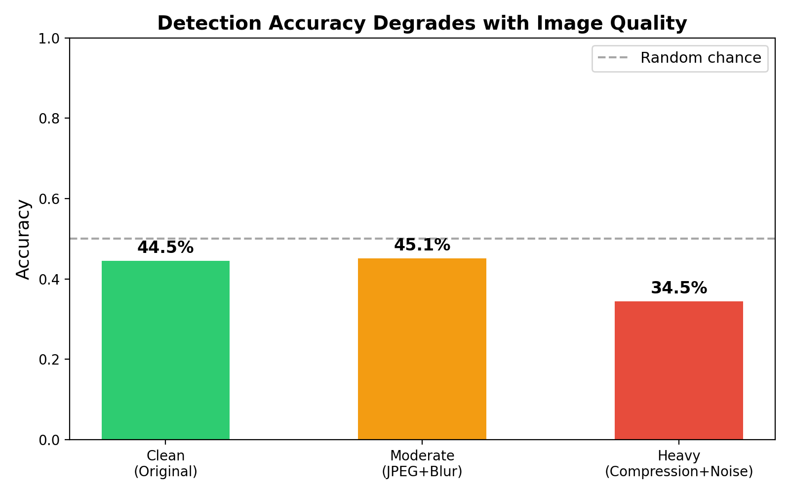
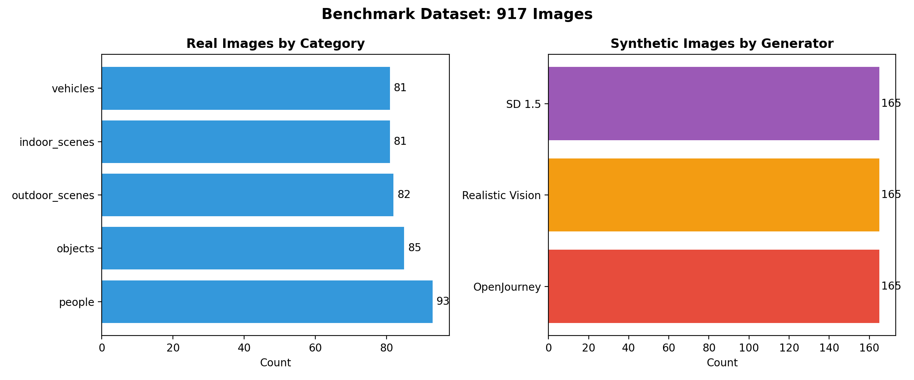
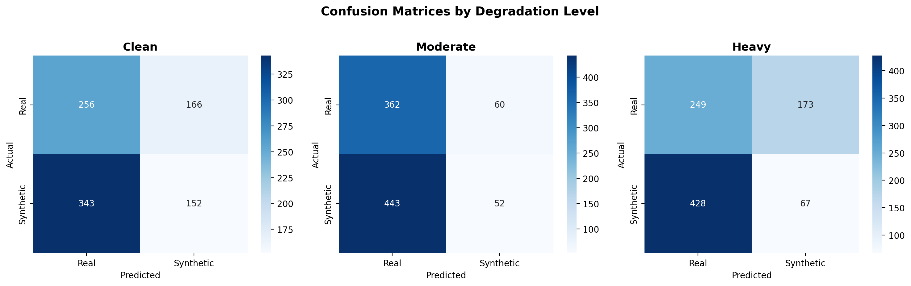
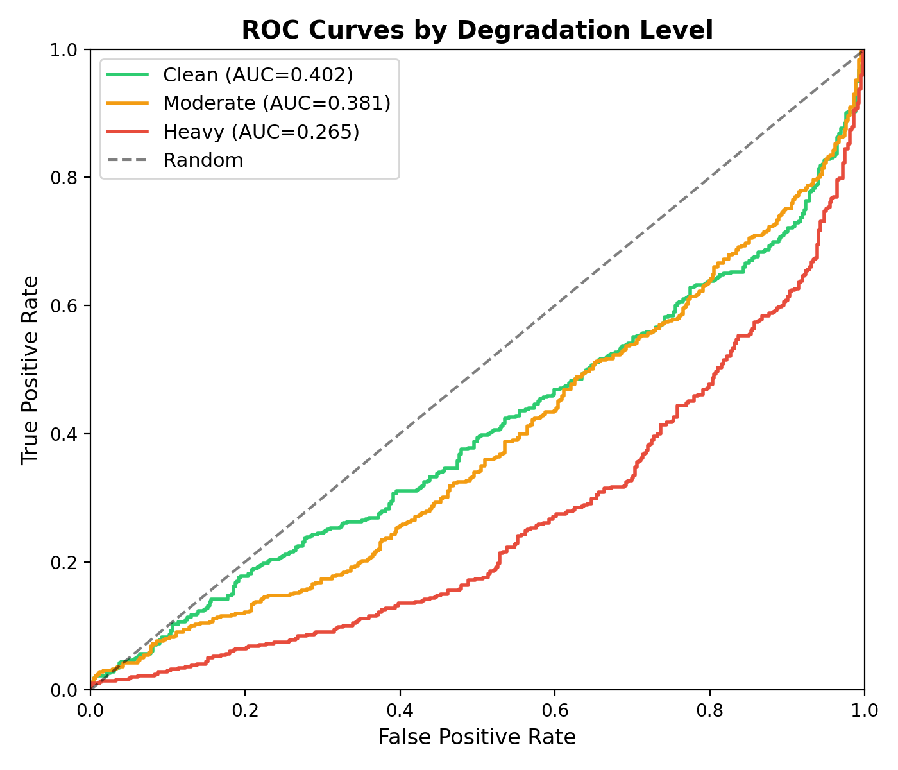

# NOBLE AI-Generated Evidence Detection Benchmark

A domain-matched benchmark for evaluating AI-generated image detection tools on law enforcement imagery (surveillance, bodycam, evidence photos), with realistic capture-condition degradation across three image-quality levels and synthetic content generated by three diffusion model architectures.

[](https://huggingface.co/datasets/ashleyscruse/noble-ai-evidence-benchmark)
[](https://creativecommons.org/licenses/by-nc/4.0/)
[](https://noblenational.org/)

---

## Headline finding

Evaluated against a widely-used open-source AI-image detector, this benchmark shows that **the detector performs worse than random chance at every quality level on law enforcement imagery**. AUC-ROC falls from 0.367 on clean images to 0.086 on bodycam-quality degradation, where 0.5 corresponds to a random classifier. Detection accuracy degrades from 40.9% to 15.5% across the same range.

The detector is not merely weak on this domain. Its confidence scores are anti-correlated with the true label, meaning it predicts the opposite of the correct answer more often than not.



*Detection accuracy across degradation levels on the NOBLE benchmark. The detector underperforms random chance at every level, with the gap widening as image quality declines.*

## Why this benchmark exists

AI-generated imagery has begun appearing in legal proceedings as submitted evidence (*Mendones v. Cushman*, 2025; the "deepfake" claim in *USA v. Reffitt*, 2022) and is the subject of proposed Federal Rule of Evidence 707. Detection tools currently marketed to forensic users have been evaluated almost exclusively on clean, web-sourced imagery, not on the imagery actually generated by surveillance, bodycam, or dashcam systems.

Existing AI-detection benchmarks (Corvi et al., 2023; Wang et al., 2020; GenImage; NIST 2025 Guardians) target the clean-web-image regime. Existing surveillance-domain benchmarks (UCF Crime; Sultani et al., 2018) target anomaly detection, not authentication. The combination of law enforcement source imagery, capture-condition degradation, and cross-architecture synthetic generation is not jointly addressed in the current landscape. This benchmark is built to fill that gap.

## What's in it

| Component                                                   |            Count |
| ----------------------------------------------------------- | ---------------: |
| Real surveillance frames (UCF Crime, 14 categories)         |            7,746 |
| Synthetic, FLUX.1-schnell (DiT)                             |            3,600 |
| Synthetic, SDXL (UNet, multi-stage)                         |            3,600 |
| Synthetic, Realistic Vision 5.1 (UNet, SD 1.5 fine-tune)    |            3,600 |
| Each image at 3 degradation levels (clean, moderate, heavy) |           55,638 |
| **Total image instances**                             | **74,184** |

Synthetic generation uses a paired-prompt design: each of 240 prompts is rendered through all three generators with matched seeds, enabling paired statistical comparison across architectures.



*Dataset composition. Real surveillance frames from UCF Crime (14 categories) and synthetic content from three generator architectures, each rendered at three quality levels.*

## Key results

Evaluation of `umm-maybe/AI-image-detector` (HuggingFace) on the full benchmark:

| Quality  | Accuracy | Precision | Recall |    F1 | AUC-ROC |
| -------- | -------: | --------: | -----: | ----: | ------: |
| Clean    |    0.409 |     0.485 |  0.256 | 0.335 |   0.367 |
| Moderate |    0.372 |     0.343 |  0.085 | 0.136 |   0.189 |
| Heavy    |    0.155 |     0.202 |  0.153 | 0.174 |   0.086 |

n = 18,546 per row (7,746 real + 10,800 synthetic).



*Per-level confusion matrices. As image quality degrades, the detector's predictions flip systematically: synthetic images are increasingly classified as real and vice versa.*



*ROC curves per degradation level, with the diagonal indicating random-classifier performance. Curves below the diagonal indicate anti-correlated predictions.*

Additional figures (per-generator breakdown, F1 by level, metric heatmaps) are in [`results/figures/`](results/figures/). Per-image predictions and confidence scores are in `results/metrics/results_huggingface_*.json`.

## Repository structure

    .
    ├── README.md                  this file
    ├── dataset_card.md            HuggingFace-format dataset card
    ├── manifest.csv               full image index with metadata
    ├── configs/
    │   ├── config.yaml            dataset specs, generation params, degradation levels
    │   └── prompts/               240 generation prompts across 4 categories
    ├── src/
    │   ├── data_collection/       UCF Crime sampling, Open Images download
    │   ├── generation/            synthetic image generation (diffusers)
    │   ├── augmentation/          degradation pipeline (clean/moderate/heavy)
    │   ├── evaluation/            detector evaluation runner
    │   └── utils/                 config loader
    ├── scripts/
    │   ├── ucf_crime/             SLURM jobs for UCF Crime download/extract
    │   ├── gen_flux.slurm         synthetic generation, FLUX-schnell
    │   ├── gen_rv51.slurm         synthetic generation, Realistic Vision 5.1
    │   ├── gen_sdxl.slurm         synthetic generation, SDXL
    │   ├── eval_hf.slurm          detector evaluation
    │   └── upload_to_hf.py        HuggingFace Hub publisher
    ├── results/
    │   ├── metrics/               per-level evaluation results (JSON + CSV)
    │   └── figures/               accuracy, F1, and metric heatmaps
    ├── share_outs/                technical brief and stakeholder communication
    └── templates/                 LaTeX poster template (Morehouse brand)

## How to use the benchmark

The benchmark is published on HuggingFace Hub. Load with the `datasets` library:

```python
from datasets import load_dataset

# Stream the full benchmark
ds = load_dataset("ashleyscruse/noble-ai-evidence-benchmark", streaming=True)

# Or filter via the manifest for a specific slice
import pandas as pd
manifest = pd.read_csv(
    "https://huggingface.co/datasets/ashleyscruse/noble-ai-evidence-benchmark/resolve/main/manifest.csv"
)
flux_heavy = manifest[(manifest["generator"] == "flux") & (manifest["level"] == "heavy")]
```

For local use, clone the benchmark via `hf` CLI:

```bash
hf download ashleyscruse/noble-ai-evidence-benchmark \
    --repo-type dataset --local-dir ./noble-benchmark
```

## Reproducing the pipeline

Full reproduction requires HPC compute (TACC Vista or comparable). See `scripts/` for the SLURM job definitions used to build v1.1. Approximate compute budget:

- Real image sampling and degradation: CPU, ~30 minutes total
- Synthetic generation (3 models, ~3,600 images each): ~5 hours total wallclock on Vista GH200
- Detector evaluation (3 quality levels, 55,638 images): ~40 minutes on Vista GH200

The repository is configured for TACC Vista. SLURM headers in `scripts/*.slurm` reference allocation `TRA25001` and partition `gh`; adjust for your site.

Reproducibility documentation (step-by-step build instructions, configuration walkthrough, and HPC adoption guide) is in development and will be published as a companion site.

## Citation

If you use this benchmark, please cite:

    @dataset{scruse2026noble,
      author    = {Scruse, Ashley},
      title     = {NOBLE AI-Generated Evidence Detection Benchmark},
      year      = {2026},
      publisher = {HuggingFace},
      version   = {1.1},
      url       = {https://huggingface.co/datasets/ashleyscruse/noble-ai-evidence-benchmark}
    }

## License

Benchmark structure, organization, metadata, and associated code are released under **CC-BY-NC-4.0**.

This dataset is compositional. Downstream users must respect source-material licenses:

- UCF Crime videos: research-use license (Sultani et al., 2018)
- Realistic Vision 5.1 outputs: CreativeML Open RAIL-M
- SDXL outputs: CreativeML Open RAIL++
- FLUX.1-schnell outputs: Apache 2.0

Commercial deployment requires separate evaluation against each source material's terms.

## Funding and compute

Funded by the National Organization of Black Law Enforcement Executives (NOBLE) through a research grant to Morehouse College. Compute powered by the Texas Advanced Computing Center (TACC) on the Vista and Stampede3 systems.

## Acknowledgments

This work was conducted at the Morehouse Supercomputing Facility. A student research team contributed to literature review, dataset exploration, and project documentation during the spring 2026 research cohort.

## Contact

**Ashley Scruse, PhD**
Deputy Director, Morehouse Supercomputing Facility
Morehouse College
ashley.scruse@morehouse.edu

## Version history

- **v1.1** (2026-05-11): Full release. Three generators (FLUX, RV51, SDXL), three degradation levels, 74,184 instances. Initial detector evaluation complete.
- **v1.0** (2026-05-06): Initial release with RV51 + SDXL only.
